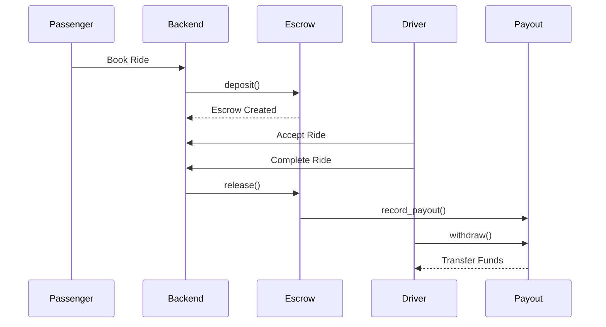

# 🚀 RideNova Smart Contract Suite

<div align="center">


[](https://rust-lang.org)
[](https://soroban.stellar.org)
[](https://stellar.org)
[](LICENSE)

### Secure, Programmable Payment Infrastructure for RideNova

**RideNova Smart Contract Suite is a collection of Soroban smart contracts that power escrow payments, automated driver settlements, and decentralized dispute resolution for the RideNova ride-hailing platform.**

Designed with a modular architecture, each contract focuses on a single responsibility, making the system easier to audit, test, and evolve while keeping payment-critical operations transparent and verifiable on the Stellar network.

</div>

---

# 📖 Table of Contents

* Overview
* Why Soroban?
* Contract Architecture
* Contract Overview
* Payment Lifecycle
* Technology Stack
* Contract Functions
* Deployment
* Project Structure
* Security
* Events
* Error Codes
* Testing
* Backend Integration
* Roadmap
* Contributing
* License

---

# 🌍 Overview

RideNova is a decentralized ride-hailing platform that leverages the Stellar network and Soroban smart contracts to deliver secure, transparent, and programmable ride payments.

Instead of relying solely on centralized payment processors, RideNova uses smart contracts to manage financial operations such as:

* Ride payment escrow
* Driver settlements
* Refund processing
* Payment verification
* Dispute resolution

This approach minimizes trust requirements while providing an auditable payment history for every completed ride.

---

# ⭐ Why Soroban?

RideNova uses Soroban because it provides the performance and programmability required for real-world transportation payments.

Soroban enables RideNova to:

* Secure passenger funds in escrow
* Automatically release payments after successful rides
* Process refunds according to platform rules
* Resolve payment disputes transparently
* Support multiple Stellar assets such as XLM and USDC

Rather than moving the entire application on-chain, RideNova adopts a hybrid architecture where blockchain is used only for payment-critical operations while ride matching, authentication, notifications, and mapping remain off-chain.

---

# 🏗 Contract Architecture

The RideNova Smart Contract Suite follows a modular architecture based on the principle of **separation of concerns**.

Instead of combining every feature into a single large contract, functionality is divided into specialized contracts with clearly defined responsibilities.

This design provides several benefits:

* Easier auditing
* Better maintainability
* Smaller WASM binaries
* Independent testing
* Reduced complexity
* Clear security boundaries
* Future extensibility

The backend coordinates communication between contracts while each smart contract remains responsible only for its own business logic.

---

# 📦 Contract Overview

| Contract               | Responsibility                                                       |
| ---------------------- | -------------------------------------------------------------------- |
| **Ride Escrow**        | Securely locks passenger funds until ride completion or cancellation |
| **Driver Payout**      | Records driver earnings and processes withdrawals                    |
| **Dispute Resolution** | Handles payment disputes and determines fund distribution            |

---

# 🔄 Contract Interaction

```text
Passenger
    │
    ▼
Ride Escrow
(deposit)
    │
    ▼
Ride Completed
    │
    ▼
Ride Escrow
(release)
    │
    ▼
Driver Payout
(record_payout)
    │
    ▼
Driver
(withdraw)
```

The backend orchestrates this flow while Soroban guarantees secure execution of every payment-related transaction.

---

# 💳 Ride Payment Lifecycle



This lifecycle ensures passenger funds remain protected until contractual ride conditions have been satisfied.

---

# 🛠 Technology Stack

| Technology      | Purpose                            |
| --------------- | ---------------------------------- |
| Rust            | Smart contract development         |
| Soroban SDK     | Smart contract framework           |
| Stellar CLI     | Build, deploy and invoke contracts |
| WASM            | Compilation target                 |
| Stellar Testnet | Development network                |
| Stellar Mainnet | Production deployment              |

# 🔗 Smart Contract Documentation

The RideNova Smart Contract Suite consists of three independent Soroban smart contracts. Together, they provide secure, transparent, and programmable payment infrastructure for the RideNova platform.

Each contract owns a single area of responsibility and exposes a well-defined public interface.

---

# 🚕 Ride Escrow Contract

## Purpose

The Ride Escrow contract protects both passengers and drivers by holding ride payments until the ride lifecycle has been successfully completed.

Instead of paying the driver immediately after booking, passenger funds remain securely locked inside the contract until the agreed conditions have been met.

This removes the need for RideNova to custody user funds while ensuring that payments are released according to transparent, deterministic rules.

---

## Responsibilities

* Lock passenger funds
* Track escrow status
* Release payments
* Process refunds
* Freeze disputed payments
* Maintain escrow records

---

## Escrow Lifecycle

```text
Created
    │
    ▼
Funded
    │
 ┌──┴───────────────┐
 ▼                  ▼
Completed       Cancelled
 │                  │
 ▼                  ▼
Released       Refunded

or

Funded
   │
   ▼
Disputed
   │
   ▼
Resolved
```

---

## Storage Model

Each escrow record stores:

```text
Escrow

ride_id

passenger

driver

asset

amount

status

created_at

released_at

transaction_hash
```

---

## Public Functions

| Function     | Caller             | Description                                                       |
| ------------ | ------------------ | ----------------------------------------------------------------- |
| initialize() | Deployer           | Initializes the contract and registers the platform administrator |
| deposit()    | Passenger          | Locks ride payment into escrow                                    |
| release()    | Driver / Admin     | Releases escrow funds after successful ride completion            |
| refund()     | Passenger / Admin  | Refunds passenger when cancellation requirements are met          |
| dispute()    | Passenger / Driver | Freezes escrow while awaiting dispute resolution                  |
| get_escrow() | Anyone             | Retrieves escrow information                                      |
| get_admin()  | Anyone             | Returns contract administrator                                    |

---

## Events

The contract emits events whenever important actions occur.

| Event          | Description               |
| -------------- | ------------------------- |
| EscrowCreated  | Passenger deposits funds  |
| EscrowReleased | Driver receives payment   |
| EscrowRefunded | Passenger receives refund |
| DisputeOpened  | Escrow frozen             |
| EscrowResolved | Dispute completed         |

---

## Security

The Escrow contract validates:

* Escrow ownership
* Authorization
* Valid ride status
* Duplicate releases
* Duplicate refunds
* Amount integrity
* Asset verification

No funds can be released unless the escrow is in a valid state.

---

# 💰 Driver Payout Contract

## Purpose

The Driver Payout contract manages driver earnings independently from the escrow process.

Once a ride has been completed and escrow funds are released, driver earnings are recorded and become available for withdrawal.

Separating payout logic from escrow simplifies auditing and allows future support for scheduled payouts, bonuses, and reward systems.

---

## Responsibilities

* Record completed payouts
* Track driver balances
* Manage withdrawals
* Maintain payout history

---

## Payout Lifecycle

```text
Ride Completed

↓

Payment Recorded

↓

Pending Balance

↓

Driver Withdraws

↓

Completed
```

---

## Storage Model

```text
Driver Balance

driver

asset

pending_balance

total_earned

total_trips

last_updated
```

---

## Public Functions

| Function            | Caller   | Description                          |
| ------------------- | -------- | ------------------------------------ |
| initialize()        | Deployer | Initializes payout contract          |
| record_payout()     | Admin    | Records earnings from completed ride |
| withdraw()          | Driver   | Withdraws pending earnings           |
| instant_payout()    | Admin    | Immediately transfers earnings       |
| get_earnings()      | Anyone   | Returns driver earnings summary      |
| get_payout_record() | Anyone   | Retrieves payout information         |

---

## Events

| Event               | Description                 |
| ------------------- | --------------------------- |
| PayoutRecorded      | Earnings added              |
| WithdrawalCompleted | Driver withdraws funds      |
| InstantPayout       | Immediate transfer executed |

---

## Security

The contract validates:

* Driver identity
* Available balance
* Authorized caller
* Duplicate payout prevention
* Withdrawal integrity

---

# ⚖️ Dispute Resolution Contract

## Purpose

The Dispute Resolution contract provides transparent arbitration for payment disagreements between passengers and drivers.

Instead of modifying escrow directly, disputes are recorded independently while preserving an auditable history of every decision.

---

## Responsibilities

* Register disputes
* Store evidence references
* Resolve payment conflicts
* Record arbitration outcomes

---

## Dispute Lifecycle

```text
Open

↓

Under Review

↓

Resolved

or

Dismissed
```

---

## Storage Model

```text
Dispute

dispute_id

ride_id

passenger

driver

asset

amount

reason

status

resolution

created_at
```

---

## Public Functions

| Function        | Caller             | Description                   |
| --------------- | ------------------ | ----------------------------- |
| initialize()    | Deployer           | Initializes contract          |
| raise_dispute() | Passenger / Driver | Opens dispute                 |
| resolve()       | Admin              | Splits escrow funds           |
| dismiss()       | Admin              | Rejects invalid dispute       |
| get_dispute()   | Anyone             | Retrieves dispute information |
| get_admin()     | Anyone             | Returns administrator         |

---

## Supported Reasons

* Driver No Show
* Passenger No Show
* Route Deviation
* Safety Concern
* Payment Issue
* Other

---

## Events

| Event            | Description         |
| ---------------- | ------------------- |
| DisputeOpened    | New dispute created |
| DisputeResolved  | Funds distributed   |
| DisputeDismissed | Dispute rejected    |

---

## Security

The contract enforces:

* Administrator authorization
* Immutable dispute records
* Valid escrow references
* Resolution validation
* Fund consistency
* Auditability

Every dispute remains permanently traceable through the Stellar ledger.

---

# 🔒 Common Security Guarantees

Across the RideNova Smart Contract Suite, the following guarantees apply:

* Role-based authorization
* State transition validation
* Replay attack protection
* Overflow-safe arithmetic
* Immutable transaction history
* Deterministic contract execution
* Transparent on-chain audit trail
* Separation of financial responsibilities
* Independent contract verification

These guarantees ensure that payment-critical operations remain secure, predictable, and verifiable.

# 🚀 Getting Started

## Prerequisites

Before building the contracts, ensure the following tools are installed.

| Tool        | Version |
| ----------- | ------- |
| Rust        | 1.78+   |
| Cargo       | Latest  |
| Stellar CLI | Latest  |
| Git         | Latest  |

Install Rust:

```bash
curl --proto '=https' --tlsv1.2 -sSf https://sh.rustup.rs | sh
```

Install the WASM target:

```bash
rustup target add wasm32-unknown-unknown
```

Install Stellar CLI:

```bash
cargo install --locked stellar-cli
```

Verify installation:

```bash
cargo --version
rustc --version
stellar --version
```

---

# 📦 Clone the Repository

```bash
git clone https://github.com/RideNova/RideNova-Contract.git

cd RideNova-Contract
```

---

# 🔨 Build Contracts

Download dependencies.

```bash
cargo fetch
```

Check compilation.

```bash
cargo check
```

Build optimized WASM binaries.

```bash
cargo build \
--target wasm32-unknown-unknown \
--release
```

Generated artifacts:

```text
target/
└── wasm32-unknown-unknown/
    └── release/
        ├── ride_escrow.wasm
        ├── driver_payout.wasm
        └── dispute_resolution.wasm
```

---

# 🧪 Testing

RideNova uses Rust's native testing framework together with standard formatting and linting tools.

Run unit tests:

```bash
cargo test
```

Format source code:

```bash
cargo fmt --all
```

Run Clippy:

```bash
cargo clippy --all-targets -- -D warnings
```

Verify release build:

```bash
cargo build \
--release \
--target wasm32-unknown-unknown
```

---

# 🚀 Deploying to Stellar Testnet

Deploy each contract individually.

Ride Escrow

```bash
stellar contract deploy \
--network testnet \
--source YOUR_SECRET_KEY \
--wasm target/wasm32-unknown-unknown/release/ride_escrow.wasm
```

Driver Payout

```bash
stellar contract deploy \
--network testnet \
--source YOUR_SECRET_KEY \
--wasm target/wasm32-unknown-unknown/release/driver_payout.wasm
```

Dispute Resolution

```bash
stellar contract deploy \
--network testnet \
--source YOUR_SECRET_KEY \
--wasm target/wasm32-unknown-unknown/release/dispute_resolution.wasm
```

Each deployment returns a Contract ID.

Store these IDs in the RideNova Backend configuration.

```env
ESCROW_CONTRACT_ID=

DRIVER_PAYOUT_CONTRACT_ID=

DISPUTE_CONTRACT_ID=
```

---

# ⚙️ Contract Initialization

After deployment, initialize each contract once.

```bash
stellar contract invoke \
--id YOUR_CONTRACT_ID \
--network testnet \
--source YOUR_SECRET_KEY \
-- initialize \
--admin YOUR_PUBLIC_KEY
```

Initialization is a one-time operation.

---

# 🔄 Backend Integration

The RideNova backend acts as the orchestration layer between the frontend and the Soroban contracts.

```text
Passenger

↓

RideNova Frontend

↓

RideNova Backend

↓

Ride Escrow Contract

↓

Driver Payout Contract

↓

Dispute Resolution Contract

↓

Stellar Network
```

The backend is responsible for:

* Authentication
* Ride management
* Fare calculation
* Contract invocation
* Transaction verification
* Event processing
* Database synchronization

The smart contracts remain responsible only for payment-critical operations.

---

# 📡 Contract Events

Each contract emits events that can be monitored by backend services.

| Event               | Description               |
| ------------------- | ------------------------- |
| EscrowCreated       | Passenger funds deposited |
| EscrowReleased      | Driver payment released   |
| EscrowRefunded      | Passenger refunded        |
| PayoutRecorded      | Earnings recorded         |
| WithdrawalCompleted | Driver withdrew earnings  |
| DisputeOpened       | New dispute created       |
| DisputeResolved     | Dispute completed         |
| DisputeDismissed    | Dispute rejected          |

Backend services can subscribe to these events to synchronize off-chain application state.

---

# ❌ Common Errors

| Error               | Description                  |
| ------------------- | ---------------------------- |
| Unauthorized        | Caller lacks permission      |
| AlreadyInitialized  | Contract already initialized |
| EscrowNotFound      | Escrow record missing        |
| InvalidStatus       | Invalid state transition     |
| InvalidAmount       | Amount validation failed     |
| AlreadyReleased     | Escrow already released      |
| AlreadyRefunded     | Escrow already refunded      |
| DisputeNotFound     | Unknown dispute              |
| InsufficientBalance | Driver balance too low       |

---

# 🗺 Roadmap

## Version 1

* ✅ Ride Escrow
* ✅ Driver Payout
* ✅ Dispute Resolution

---

## Version 2

* 🚧 Event indexing
* 🚧 Improved payment verification
* 🚧 Multi-asset optimization
* 🚧 Contract upgrade tooling

---

## Version 3

* ⏳ Driver reputation contract
* ⏳ Insurance contract
* ⏳ Rewards contract
* ⏳ Treasury contract

---

## Version 4

* ⏳ Governance
* ⏳ Community staking
* ⏳ Cross-chain interoperability

---

# 🤝 Contributing

Contributions are welcome from developers, security researchers, auditors, technical writers, and Rust enthusiasts.

To contribute:

1. Fork the repository.
2. Create a feature branch.

```bash
git checkout -b feature/my-feature
```

3. Commit your changes.

```bash
git commit -m "feat: add escrow enhancement"
```

4. Push your branch.

```bash
git push origin feature/my-feature
```

5. Open a Pull Request.

---

## Contribution Areas

We especially welcome contributions in:

* Smart contract security
* Rust optimization
* Soroban best practices
* Testing
* Documentation
* Performance improvements
* Code reviews

---

# 📄 License

RideNova Smart Contract Suite is released under the MIT License.

See the LICENSE file for details.

---

# 🙏 Acknowledgements

Special thanks to:

* Stellar Development Foundation
* Soroban
* Rust Community
* Drips Network
* Every contributor helping build RideNova

---

<div align="center">

### ⭐ Building Secure Programmable Payments on Stellar

**If this project helps you, consider giving the repository a star.**

Made with ❤️ by the RideNova Community.

</div>

